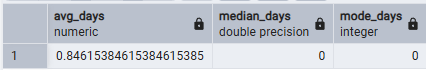
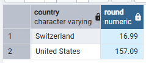
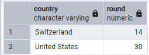

I was interested in finding out if we can draw any conclusions about the amount of time a visitor spends on the site and how much money they spend. I created the following view to help me query the data:

```
CREATE OR REPLACE VIEW visitors_with_orders

AS 
(
WITH session_analytics AS (
	SELECT
		a.fullvisitorid,
		a.visitid,
		s.channelgrouping,
		time,
		country,
		city,
		round(totaltransactionrevenue/1000000::numeric,2) as totaltransactionrevenue,
		revenue,
		a.pageviews,
		a.timeonsite,
		s.date,
		productcategory,
		productname,
		productsku,
		CASE
			WHEN a.fullvisitorid IN (SELECT distinct(fullvisitorid) FROM all_sessions a1
				WHERE totaltransactionrevenue IS NOT NULL)
				THEN 1
				ELSE 0 END
			AS has_made_purchase -- identifies visitors who have made a purchase even if they have also visited the site and not made a purchase
	FROM analytics a
		LEFT JOIN all_sessions s
		ON (s.fullvisitorid = a.fullvisitorid
		AND a.visitid IS NOT NULL -- limits the join to include only repeat visitors with unique visitids
		AND s.timeonsite > 0 -- limits the join to include only visitors who spent time on the site
		AND s.timeonsite = a.timeonsite) -- limits the join to include only visitors where timeonsite is the same across both tables
),
-- identifies the date of a visitor's first visit as well as the date of their first purchase
first_dates AS (
	SELECT fullvisitorid, 
	MIN(date::date) OVER (PARTITION BY fullvisitorid ORDER BY date ASC) AS first_visit,
	MIN(CASE when totaltransactionrevenue IS NOT NULL then date::date END) OVER (PARTITION BY fullvisitorid ORDER BY coalesce(totaltransactionrevenue,0) ASC) AS first_purchase,
	has_made_purchase
	FROM session_analytics
	WHERE date IS NOT NULL
	GROUP BY has_made_purchase, fullvisitorid, totaltransactionrevenue, date
	ORDER BY has_made_purchase DESC
)

SELECT 
	distinct(sa.fullvisitorid),
	first_visit,
	first_purchase,
	productcategory,
		productname,
		productsku,
		country,
		city,
	sum(totaltransactionrevenue) OVER (PARTITION BY sa.fullvisitorid) as total_revenue, -- dedupes revenues
	first_purchase - first_visit as days_to_first_purchase,
	count(totaltransactionrevenue::varchar) OVER (PARTITION BY sa.fullvisitorid) as num_orders, -- dedupes the number of orders
	sum(timeonsite) OVER (PARTITION BY sa.fullvisitorid) as total_timeonsite, -- dedupes time in seconds
	round(sum(timeonsite) OVER (PARTITION BY sa.fullvisitorid)/60,2) as total_timeonsite_inmins, -- dedupes time in minutes
	sum(pageviews) OVER (PARTITION BY sa.fullvisitorid) as total_pageviews -- dedupes the number of page views per visitor
FROM session_analytics sa
	JOIN first_dates fd
	ON sa.fullvisitorid = fd.fullvisitorid
		AND first_purchase IS NOT NULL -- removes duplicate lines where a visitor visited the site but did not make a purchase on that date but later did make a purchase
GROUP BY sa.fullvisitorid, 
	first_visit,
	first_purchase,
	productcategory,
		productname,
		productsku,
		country,
		city,
	totaltransactionrevenue,
	timeonsite,
	pageviews
ORDER BY days_to_first_purchase DESC
)
```

Question 1: Do people spend more money the more time they spend on the site?

SQL Queries:

```
-- query calculates the dollar value of 1 minute on the site based on the revenue generated per unique visitor over time
SELECT
	DISTINCT fullvisitorid, 
	days_to_first_purchase, 
	total_revenue,
	total_timeonsite_inmins,
	round(total_revenue / total_timeonsite_inmins,2) as time_vs_revenue
FROM visitors_with_orders
```

Answer: I played with ordering by `total_revenue`, `total_timeonsite_inmins` and `time_vs_revenue` but did not find any meaningful correlation between time spent on the site and revenue.



Question 2: How many days is there between the average visitor's first visit and their first purchase?
SQL Queries:

```
SELECT
	AVG(days_to_first_purchase) as avg_days,
	PERCENTILE_CONT(0.5) WITHIN GROUP(ORDER BY days_to_first_purchase) as median_days,
	MODE() WITHIN GROUP(ORDER BY days_to_first_purchase) AS mode_days
FROM visitors_with_orders
```

Answer:


Question 3: Are visitors from certain countries likely to spend more money than others?

SQL Queries:

```
SELECT
	distinct country,
	round(AVG(total_revenue) OVER (PARTITION BY country),2)
FROM visitors_with_orders
WHERE country IS NOT NULL
GROUP BY country, total_revenue
```

Answer:


Question 4: Are visitors from certain countries likely to spend more time on the site than others?
SQL Queries:

```
SELECT
	distinct country,
	round(AVG(total_timeonsite_inmins) OVER (PARTITION BY country),0)
FROM visitors_with_orders
WHERE country IS NOT NULL
GROUP BY country, total_timeonsite_inmins
```

Answer:


