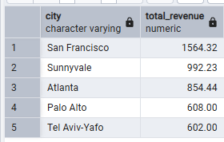

All answers are based on a view created using the following query as described in the readme:

```
CREATE OR REPLACE VIEW session_totals
AS 
    (SELECT 
	visitid,
        CASE
			WHEN city = 'New York' THEN 'United States'
			ELSE country END as country, -- corrects item where New York appears under Canada
        city,
	round(totaltransactionrevenue/1000000::numeric,2) as total_revenue,
	round(productprice/1000000::numeric,2),
        date::DATE as date_of_visit,
        productsku AS sku,
        productname,
        productcategory
    FROM all_sessions
    WHERE totaltransactionrevenue <> 0 AND
	totaltransactionrevenue IS NOT NULL)
```

# Question 1: Which cities and countries have the highest level of transaction revenues on the site?

## SQL Queries:

##### Top country query:

```
SELECT country, sum(total_revenue) AS total_revenue
FROM session_totals
GROUP BY country
ORDER BY sum(total_revenue) DESC
LIMIT 5
```

##### Top city query:

```
SELECT city, sum(total_revenue) AS total_revenue
FROM session_totals
WHERE city <> 'not available in demo dataset' -- excludes values where the city is unknown
GROUP BY city
ORDER BY sum(total_revenue) DESC
LIMIT 5
```

## Answer:

By country:


By city:



# Question 2: What is the average number of products ordered from visitors in each city and country?

## SQL Queries:

#####	Average number of products ordered per country:

```
SELECT DISTINCT country, round(avg(count(distinct sku)) OVER (PARTITION BY country),2) as avg_products -- counts distinct skus per order in place of using the quantity which is missing values
FROM session_totals
GROUP BY country, visitid
ORDER BY avg_products DESC
```

#####	Average number of products ordered per city:

```
SELECT DISTINCT city, round(avg(count(distinct sku)) OVER (PARTITION BY city),2) as avg_products -- counts distinct skus per order in place of using the quantity which is missing values
FROM session_totals
WHERE city <> 'not available in demo dataset' -- excludes values where the city is unknown
GROUP BY city, visitid
ORDER BY avg_products DESC
```

## Answer:

By country:


By city:


# Question 3: Is there any pattern in the types (product categories) of products ordered from visitors in each city and country?

## SQL Queries:

##### Product categories ordered by visitors in country:

```
SELECT distinct(country) as country, productcategory, count(distinct sku) as num_products_ordered FROM session_totals -- counts distinct skus per order in place of using the quantity which is missing values
WHERE productcategory NOT IN
	('${escCatTitle}','(not set)') -- ignores product categories where the values are missing but not null
GROUP BY country, productcategory
ORDER BY country, num_products_ordered DESC
```

##### Product categories ordered by visitors in each city:

```
SELECT distinct(city) as city, productcategory, count(distinct sku) as num_products_ordered FROM session_totals -- counts distinct skus per order in place of using the quantity which is missing values
WHERE productcategory NOT IN
    ('${escCatTitle}','(not set)') -- ignores product categories where the values are missing but not null
    AND city <> 'not available in demo dataset' -- excludes values where the city is unknown
GROUP BY city, productcategory
ORDER BY city, num_products_ordered DESC
```

## Answer:

I don't think there is enough data available to draw any conclusions about ordering patterns by either country or city.

By country:


By city:


Question 4: What is the top-selling product from each city/country? Can we find any pattern worthy of noting in the products sold?

SQL Queries:

##### By country:

```
-- subquery generates the product rankings by country
WITH rankings AS (
	SELECT
    productname,
    country,
	sum(total_revenue),
    DENSE_RANK() OVER (PARTITION BY country ORDER BY sum(total_revenue) DESC) AS rank_by_country
  FROM session_totals
  GROUP BY country, productname
)

-- filters the above query to show only the top product in each country
SELECT
	 *
FROM rankings
WHERE rank_by_country = 1
```

##### By city:

```
-- subquery generates the product rankings by city
WITH rankings AS (
	SELECT
    productname,
    city,
	sum(total_revenue),
    DENSE_RANK() OVER (PARTITION BY city ORDER BY sum(total_revenue) DESC) AS rank_by_city
  FROM session_totals
  WHERE city <> 'not available in demo dataset'
  GROUP BY city, productname
)

-- filters the above query to show only the top product in each city
SELECT
	 *
FROM rankings
WHERE rank_by_city = 1
```

Answer:

By country:


By city:


Question 5: Can we summarize the impact of revenue generated from each city/country?
SQL Queries:

```
-- generates a summary of orders by country over time, allowing for analysis of product sales by country and city (where available) and identify seasonality, if any
SELECT country,
	CASE 
		WHEN city = 'not available in demo dataset' THEN NULL
		ELSE city END as city,
	productcategory, 
	productname, 
	sku,
	EXTRACT(YEAR from date_of_visit) as visityear, 
	EXTRACT(QUARTER from date_of_visit) as visitquarter, 
	EXTRACT(MONTH from date_of_visit) as visitmonth, 
	EXTRACT(DAY from date_of_visit) as visitday, 
	EXTRACT(MONTH from date_of_visit) as visitmonth, 
	DATE_PART('isodow',date_of_visit) as visitday_ofweek, -- 1 = Monday
	SUM(total_revenue) AS total_revenue
FROM session_totals
GROUP BY country, city, productcategory, sku, productname, date_of_visit
```

By city:

```
-- generates a summary of orders by city over time, allowing for analysis of product sales by country and city and identify seasonality, if any
SELECT 	city,
	productcategory, 
	productname, 
	sku,
	EXTRACT(YEAR from date_of_visit) as visityear, 
	EXTRACT(QUARTER from date_of_visit) as visitquarter, 
	EXTRACT(MONTH from date_of_visit) as visitmonth, 
	EXTRACT(DAY from date_of_visit) as visitday, 
	EXTRACT(MONTH from date_of_visit) as visitmonth, 
	DATE_PART('isodow',date_of_visit) as visitday_ofweek, -- 1 = Monday
	SUM(total_revenue) AS total_revenue
FROM session_totals
WHERE city <> 'not available in demo dataset' -- excludes data where city is not defined
GROUP BY country, city, productcategory, sku, productname, date_of_visit
```

Answer:

By country:


By city:

